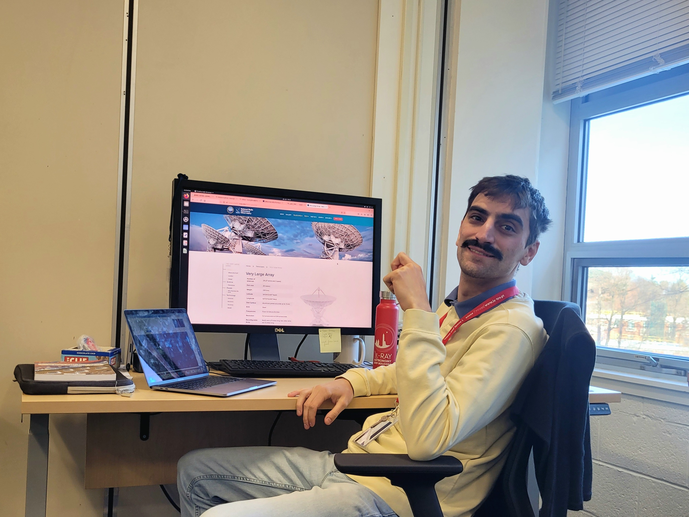

**Don't hesitate to contact me !**\
email: luca.ighina (@) cfa.harvard.edu

If you need a scientific reference, please contact any of these close collaborators/supervisors:
- [Alessandro Caccianiga](https://brera.inaf.it/contatti/telefoni-e-mail/) — INAF-Brera, Milano, Italy
- [Alberto Moretti](https://brera.inaf.it/contatti/telefoni-e-mail/) — INAF-Brera, Milano, Italy
- [Thomas Connor](https://www.cfa.harvard.edu/people/thomas-connor/) — Centerr for Astrophysics, Cambridge, USA
- [Nick Seymour](https://staffportal.curtin.edu.au/staff/profile/view/nick-seymour-c087930b/) — ICRAR-Curtin, Perth, Australia

<!-- -->

<figure style="text-align: center;">
  
  <figcaption>Me during a typical working day :)</figcaption>
</figure>

[Go back](./)
