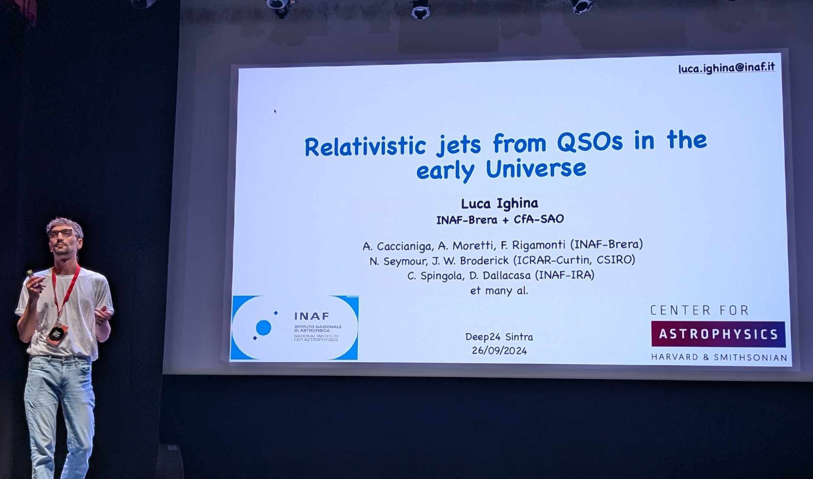

# Curriculum Vitae

Detailed CV can be found [here](docs/CV_Ighina.pdf)

## Research Experience
- <h3 style="margin-bottom: 0;">Post-doctoral fellow at the Center for Astrophysics | Harvard & Smithsonian</h3>
  Cambridge, MA, USA │ November 2024 — current
- <h3 style="margin-bottom: 0;">Post-doc at the INAF-Brera Observatory</h3>
  Milano, Italy │ March 2024 — November 2024

## Education
- <h3 style="margin-bottom: 0;">PhD in Astrophysics</h3>
  Università degli Studi dell'Insubria, Como — INAF-Brera, Milano\
  November 2020 — January 2024\
  One year visit at ICRAR-CIRA, Perth, Australia\
  Project Title: *Relativistic jets from QSOs in the early Universe*

- <h3 style="margin-bottom: 0;">Master's degree in Astrophysics and Physics of Space</h3> 
  Università degli Studi di Milano-Bicocca, Milano, Italy \
  October 2018 — October 2020\
  One semester spent at Université d'Aix-Marseille, France, 2019\
  Internship at the INAF-Brera observatory, Milano (12 months)

- <h3 style="margin-bottom: 0;">Undergraduate degree in Physics</h3>
  Università degli Studi di Milano-Bicocca, Milano, Italy \
  October 2015 — October 2018\
  One semester spent at Université de Bordeaux, France, 2018\
  Internship at the INAF-Brera observatory, Milano (6 months)

<!--  ## First Author Publications

Full list of referred publications can be found **[here](https://ui.adsabs.harvard.edu/public-libraries/1d8_iPsRTDOkwPHmys5B_g)**.
-->

## Teaching and Supervision
- Supervision of a student for the [REU](https://www.cfa.harvard.edu/opportunities/graduate-undergraduate-programs/reu-summer-intern-programstudent) summer internship at the CfA — June-August 2025
- Co-supervision of a student for the [REU](https://www.cfa.harvard.edu/opportunities/graduate-undergraduate-programs/reu-summer-intern-programstudent) summer internship at the CfA — June-August 2025
- Co-supervision of a master's student during their thesis — April-October 2025
- Co-supervision of an undergraduate student during their thesis — May-September 2024
- Teaching 20 hours of practical exercises of 'Introduction to Statistics and Informatics' at the Università degli Studi di Milano Statale (2021–
2022, professor V. Cotroneo).

## Invited Seminars

- AGN group Santiago seminar — 1 October 2025 — Santiago (Chile)\
*Relativistic jets at high redshift and the evolution of the most massive BHs*

- ESO Seminar — 30 September 2025 — ESO, Santiago (Chile)\
*Tracing the evolution of jetted AGN with Blazars*

- High energy seminar — 2 April 2025 — CfA, Cambridge, MA (US)\
*X-ray view on blazars and relativistic jets at high redshift*
  ([see recording](https://www.youtube.com/watch?v=rlUYSzSdtwQ))

- Radio, Sub-Millimiter (RMS) seminar — 15 November 2024 — CfA, Cambridge, MA (US)\
  *Radio Quasars and their relativistic jets in the early Universe*

- Weekly seminar at Institute of Astrophysics and Space Sciences — 7 June 2024 — Lisbon (Portugal)\
  *Relativistic jets from QSOs in the early Universe*

- Weekly seminar at Osservatorio Astoronomico di Brera — 16 April 2024 — Merate (Italy) \
  *Relativistic jets from QSOs in the eraly Universe*
  ([see recording](https://drive.google.com/file/d/1OXlkIJecYG4UiS-rz4gBZ3r061ZNtuXI/view))

- Hypatia Colloquium — 14 June 2022 — ESO/Garching (Germany)\
  *Impact of the CMB on the evolution of AGNs and their relativisitc jets at the highest redshifts*
  ([see recording](https://www.youtube.com/watch?v=1Up8CkW6O1k))

## Service and Outreach
- Member of the EMU/Euclid Coordination Team
- Referee for the Astrophysical Journal and the Universe journal
- member of the NOIRLab Time Allocation Commettee (2025)
<!-- - Referee for the Universe journal, Multidisciplinary Digital Publishing Institute -->
<!--- ESO, TNG, LBT and Chandra proposal reviewer\ --> 

- Participation to national TV and radio news/shows in Italy to discuss research and Black Holes physics (see [News section](./news.html))
-  Outreach talk at the Public Observatory Nights, hosted by the Harvard College Observatory: "Black Hole Jetstreams: The Most Powerful Engines in the Universe"

- Podcast Interview: "Ask the Universe with Karolina: Massive black holes and jets"
- Participation to the outreach event: "Historic Change: Celebrating the Life and Legacy of Dr. Vera Rubin"
- Participation to several events/festivals with the Harvard observatory stand

<figure style="text-align: center;">

  <figcaption> 
 Me presenting my work during the Deep24 international conference in Lisbon, Portugal.
 </figcaption>
</figure>

[Go back](./)
