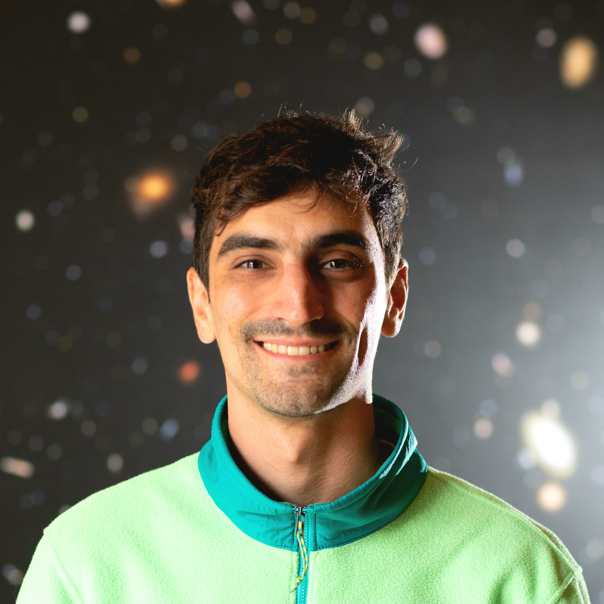

## Observing experience
I have worked with several telescopes accross the electromagnetic spectrum with experience in the preparation/execution of observations and data reduction of:
- Radio: ATCA, VLA, uGMRT, LBA, eMERLIN
- Optical/near-infrared: LBT, VLT, TNG, Gemini-South, AAT
- X-ray: Chandra, XMM-Newton, Swift-XRT

<!--   -->

[Go back](./)
