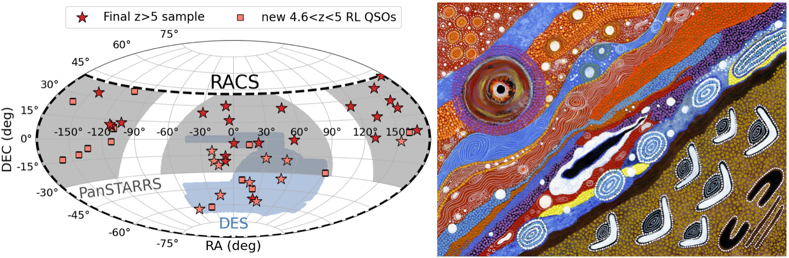
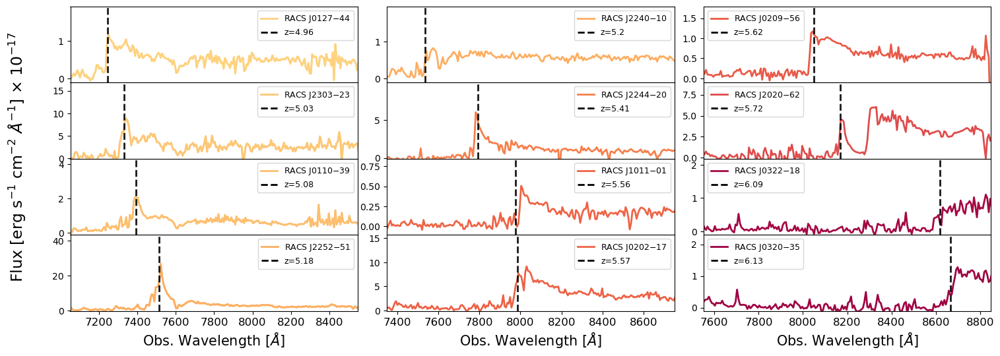

# Research Interests:

During my research I study the most massive black holes in the primordial Universe. 
In particular, I focus on Active Galactic Nuclei (or Quasars) able to expel part of the accreting material in the form of two bipolar jets of relativistic particles.
To this end, I use some of the most sensitive telescopes currently available across the electromagnetic spectrum.

### Search for new Jetted Quasars in the primordial Universe

### Multi-wavelength characterisation of high-z Jetted Quasars

### Characterise the emission and evolution of kilo-parsec scale jets

[Go back](./)
