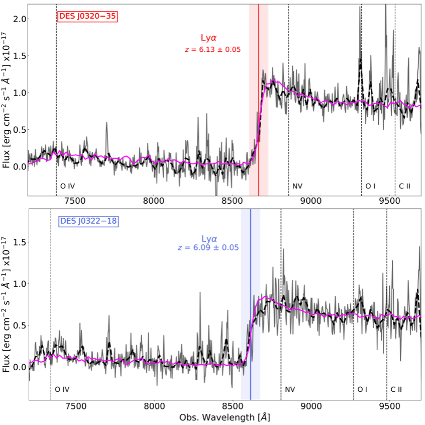
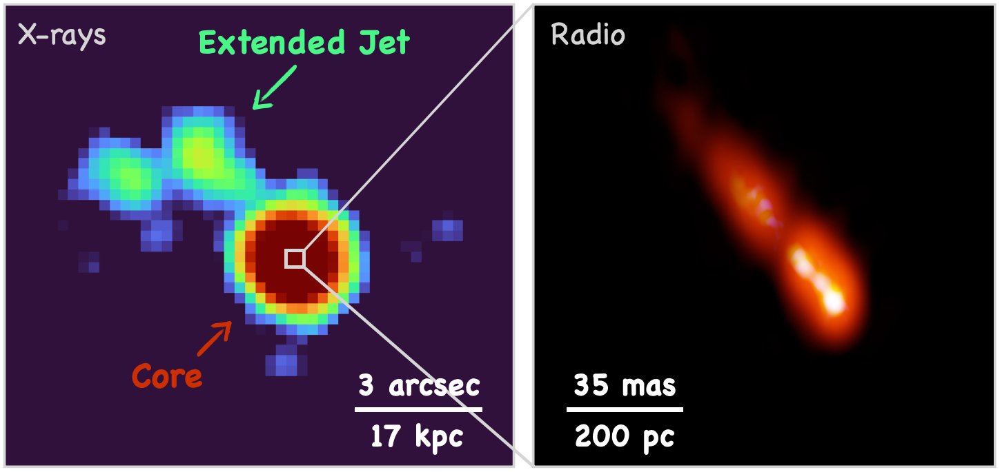

# Research Interests:

During my research I study supermassive massive black holes (SMBHs) in the primordial Universe. 
In particular, I focus on Active Galactic Nuclei and Quasars able to expel part of the accreting material in the form of two bipolar jets of relativistic particles.
To this end, I use some of the most sensitive telescopes currently available across the electromagnetic spectrum.

<figure style="text-align: center;">

  <figcaption> 
 Artistic representation of the RACS radio survey by Margaret Whitehurst, a Wajarri artist.
 The Wajarri Yamaji people are the traditional owners and custodians of the land where the ASKAP telescope is located.
 </figcaption>
</figure>

### Search for Jetted Quasars in the primordial Universe

SMBHs in the primordial Universe, z>5, are extremely rare sources, especially those hosting relativistic jets. 
For this reason, dedicated searches are need to select and identify such objects. 
As part of my work I combine deep multi-wavelength surveys that cover a large fraction of the sky in order to select good high-z jetted quasar candidates. 
Once a well-defined sample is built, I perform dedicated spectroscopic observations with some of the largest ground based telescopes currently available in order to have a reliable estimate of the redshift of the candidates. 
For example, in [Ighina et al. 2025](https://arxiv.org/abs/2504.10573) we built the largest statistical sample of jetted quasars at z>5 currently available. 
The candidate selection in this work was based on the RACS radio surveys (see figure below) performed with the ASKAP telescope in Western Australia.

<figure style="text-align: center;">

  <figcaption> 
Left panel: artistic representation of the RACS radio survey by Margaret Whitehurst, a Wajarri artist.
The Wajarri Yamaji people are the traditional owners and custodians of the land where the ASKAP telescope is located.
Right panel: example of the optical spectrum of a z>6 jetted quasars selected from RACS with a redhsift confirmation from the Gemini-South telescope.
 </figcaption>
</figure>

<!--
 -->

### Multi-wavelength characterisation of high-z Jetted Quasars

### Study the emission and evolution of kilo-parsec scale jets
Relativistic jets in quasars originate from the vicinity of the central SMBHs and can extend up to Mega-parsecs scales.
These jets play an essential part of galaxy evolution, as they can strongly affect the properties of the host galaxy as well as the surrounding intergalactic medium. 
One way to constrain the energy jets can release in the form of feedback is by performing spatially resolved analysis of their multi-wavelength properties. 
However, only the brightest and most extended (to kilo-parsec scales) jets can be resolved in the X-rays, making these types of studies very challenging.
During my work I search for and study kilo-parsec scales jets in the X-rays in order to characterise their evolution across redshift.
In particular, In [Ighina et al. 2022](https://www.aanda.org/articles/aa/full_html/2022/03/aa42676-21/aa42676-21.html), I was able to identify what is now the highest redshift X-ray jet currently known (see image below).
The detection of this jet allowed us to constrain the properties of large-scale jets in the first Gyr of the Universe for the first time.

<figure style="text-align: center;">

  <figcaption> 
Highest redshift jet currently imaged in the X-rays, left panel. Adapted from Ighina et al. 2022. 
On the right, zoom in on the innermost regions of the jet in the radio band. image credit Spingola et al. 2020 and Bill Saxton NRAO/AUI/NSF.
 </figcaption>
</figure>

[Go back](./)
