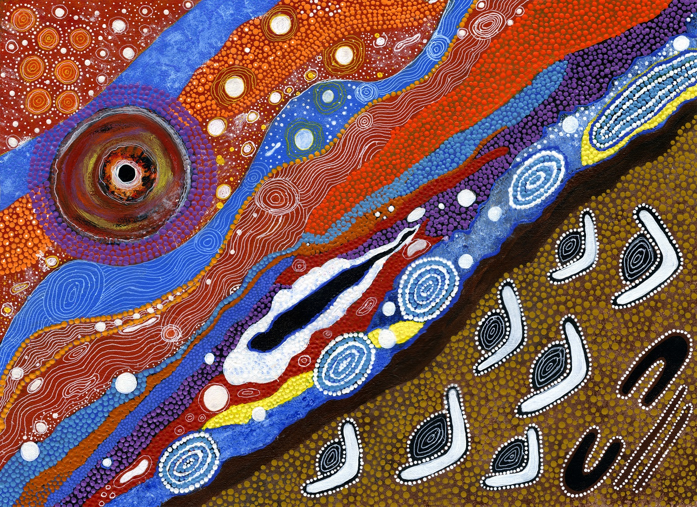

# Research Interests:

During my research I study supermassive massive black holes (SMBHs) in the primordial Universe. 
In particular, I focus on Active Galactic Nuclei (or Quasars) able to expel part of the accreting material in the form of two bipolar jets of relativistic particles.
To this end, I use some of the most sensitive telescopes currently available across the electromagnetic spectrum.

<figure style="text-align: center;">

  <figcaption> 
 Artistic representation of the RACS radio survey by Margaret Whitehurst, a Wajarri artist.
 The Wajarri Yamaji people are the traditional owners and custodians of the land where the ASKAP telescope is located.
 </figcaption>
</figure>

### Search for Jetted Quasars in the primordial Universe

SMBHs in the primordial Universe, z>5, are extremely rare sources, especially those hosting relativistic jets. 
For this reason, dedicated searches are need to select and identify such objects. 
As part of my work I combine deep multi-wavelength surveys that cover a large fraction of the sky in order to select good high-z jetted quasar candidates. 
Once a well-defined sample is built, I perform dedicated spectroscopic observations with some of the largest ground based telescopes currently available in order to have a reliable estimate of the redshift of the candidates. 
For example, in [Ighina et al. 2025](https://arxiv.org/abs/2504.10573) we built the largest statistical sample of jetted quasars at z>5 currently available. 
The candidate selection in this work was based on the RACS radio surveys (see figure below) performed with the ASKAP telescope in Western Australia.

<figure style="text-align: center;">

  <figcaption> 
Optical spectrum of two z>6 jetted quasars selected from RACS and identified confirmed with the Gemini-South telescope.
 </figcaption>
</figure>

<!--
 -->

### Multi-wavelength characterisation of high-z Jetted Quasars

### Study the emission and evolution of kilo-parsec scale jets

[Go back](./)
